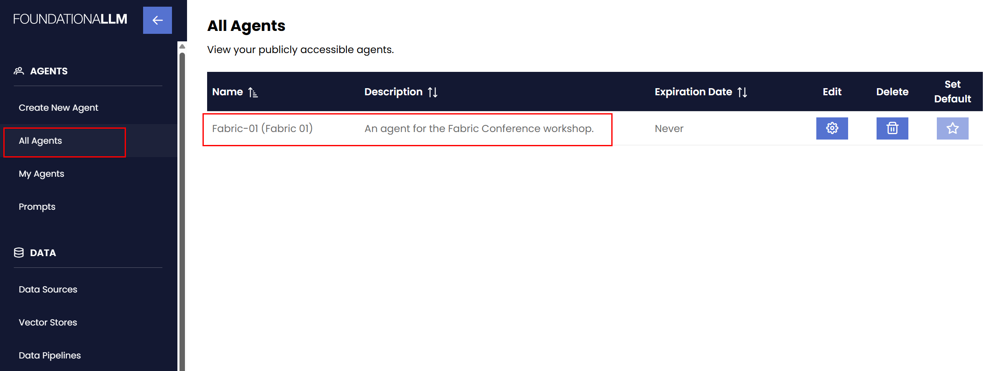
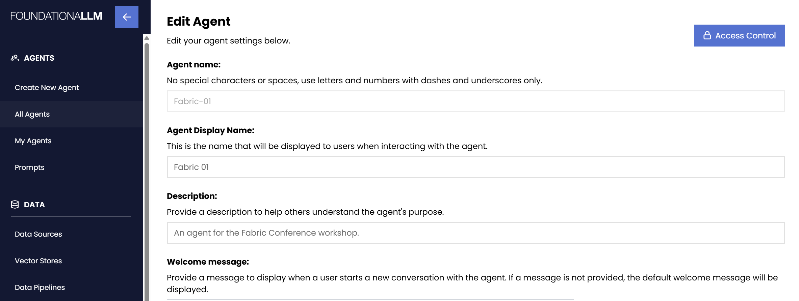
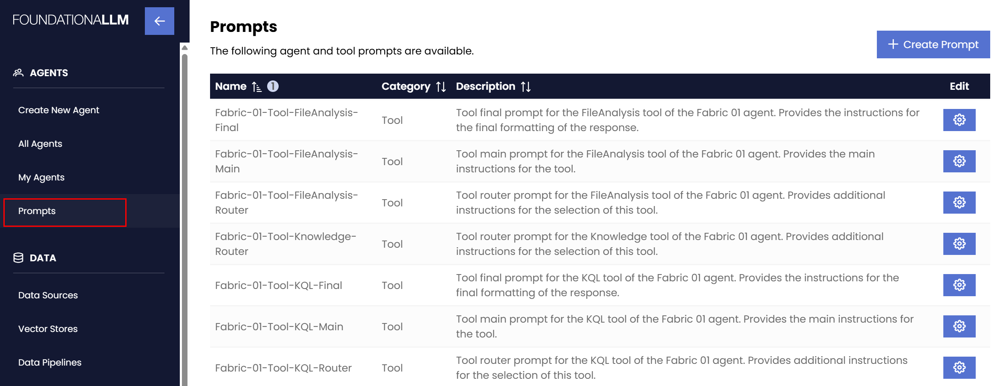
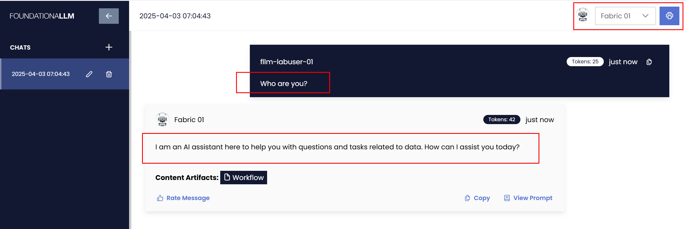
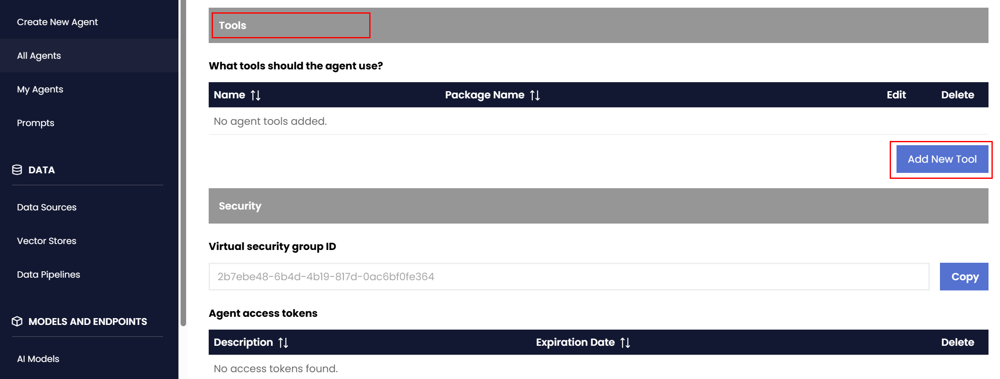
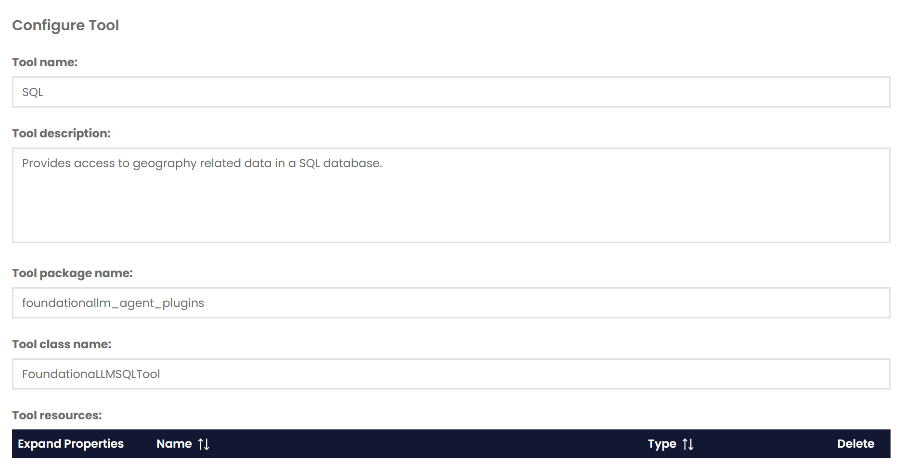
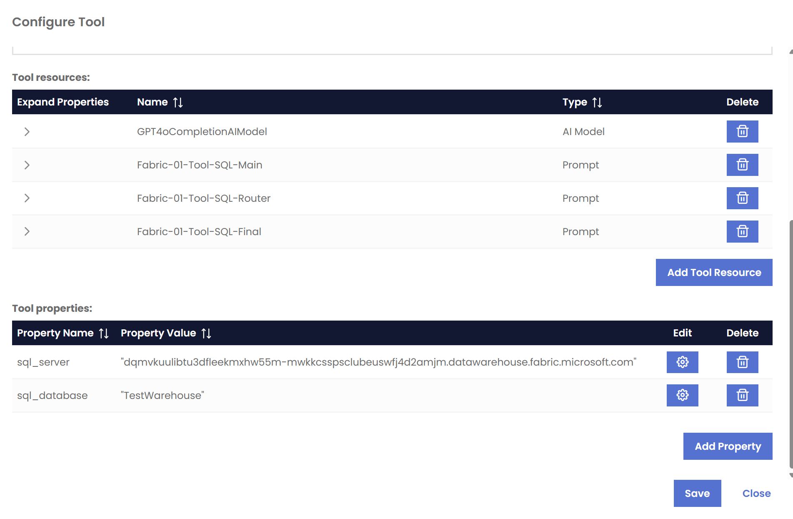
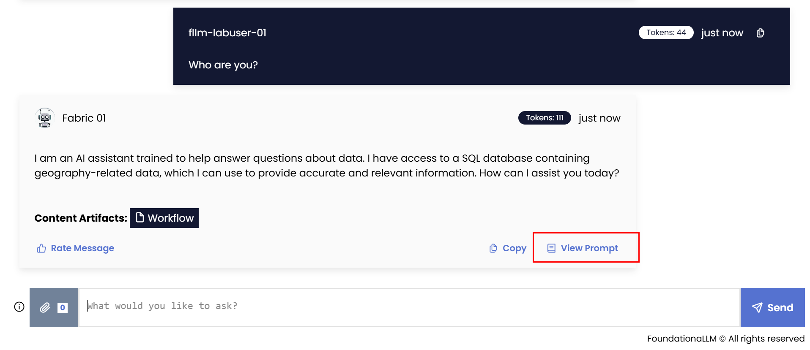
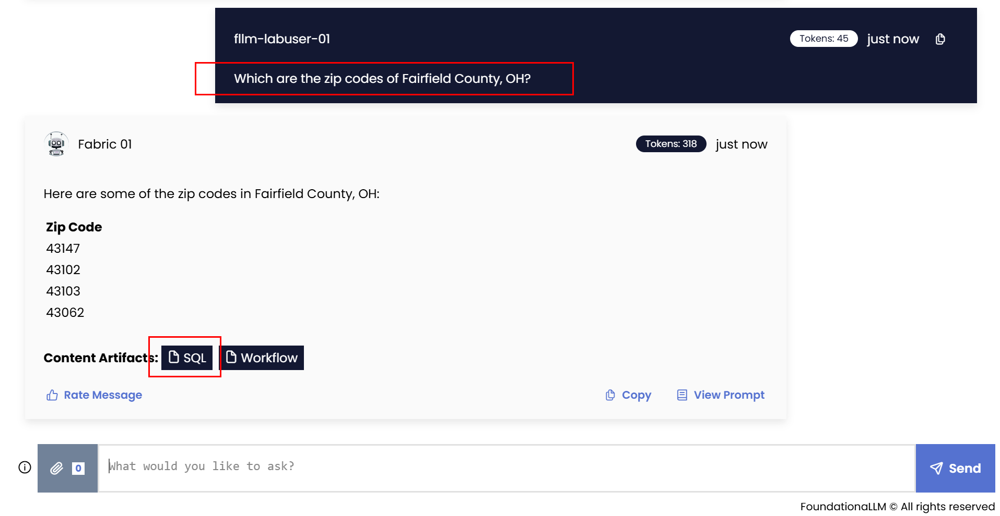

# Building Analytics Agents for Microsoft Fabric

This repository contains the lab materials for the **Building Analytics Agents for Microsoft Fabric** workshop.

## Prerequisites - Preparing for the exercises

>[!NOTE]
>Your workshop account should be `fllm-labuser-NN@foundationallm.ai` (where `NN` is your lab number assigned at the beginning of the workshop).

1. Login to the [FoundationaLLM Management Portal](https://camanagementuil43jljq2i5ox6.lemondesert-a0804c39.eastus2.azurecontainerapps.io/) using your workshop account.
2. Navigate to the `All Agents` section and locate the `Fabric-NN` agent.

    

3. Select the `Edit` action associated with the agent and observe the properties of the agent. Make sure you scroll all the way down to see all the properties.

     

4. Navigate to the `Prompts` section and locate the prompts associated with the `Fabric-NN` agent.

    

5. Login to the [FoundationaLLM User Portal](https://cachatuil43jljq2i5ox6.lemondesert-a0804c39.eastus2.azurecontainerapps.io/) using your workshop account.
6. In the top-right corner, select the `Fabric-NN` agent from the dropdown list. This will allow you to interact with the agent you will be working with during the workshop. Ask the agent `Who are you?` to confirm everything is working correctly. The agent should respond as follows:

   

>[!NOTE]
>For the reminder of this workshop, the **FoundationaLLM Management Portal** will be referred to as **Management Portal** and the **FoundationaLLM User Portal** will be referred to as **User Portal**. Also, `NN` will identify the lab number assigned to you at the beginning of the workshop.

## Exercise 1 - Providing context to an agent using a Fabric Warehouse

In this exercise, you will add a SQL tool to the `Fabric-NN` agent. This tool will allow the agent to access data stored in a Fabric Warehouse. You will also modify the prompts associated with the agent to provide context about the data available in the SQL database.

1. In the **Management Portal**, navigate to the `All Agents` section, locate the `Fabric-NN` agent, and select the `Edit` action associated with it. Scroll down to the `Tools` section and select the `Add New Tool` button.

    

2. Enter the following values:
   - **Tool name**: `SQL`
   - **Tool description**: `Provides access to geography related data in a SQL database.`
   - **Tool package name**: `foundationallm_agent_plugins`
   - **Tool class name:**: `FoundationaLLMSQLTool`

    

    Do not save yet and scroll down to the **Tool resources** section.

3. Select the `Add Tool Resource` button and enter the following values:
    - **Resource Type**: `Model`
    - **Resource**: `GPT4oCompletionAIModel`
    - **Resource Role**: `main_model`
  
    Select `Save` to save the resource but do not save the tool yet.

4. Select the `Add Tool Resource` button and enter the following values:
    - **Resource Type**: `Prompt`
    - **Resource**: `Fabric-01-Tool-SQL-Main`
    - **Resource Role**: `main_prompt`
  
    Select `Save` to save the resource but do not save the tool yet.

5. Select the `Add Tool Resource` button and enter the following values:
    - **Resource Type**: `Prompt`
    - **Resource**: `Fabric-01-Tool-SQL-Router`
    - **Resource Role**: `router_prompt`
  
    Select `Save` to save the resource but do not save the tool yet.

6. Select the `Add Tool Resource` button and enter the following values:
    - **Resource Type**: `Prompt`
    - **Resource**: `Fabric-01-Tool-SQL-Final`
    - **Resource Role**: `final_prompt`
  
    Select `Save` to save the resource but do not save the tool yet.
7. Select the `Add Property` button and enter the following values:
    - **Property Key**: `sql_server`
    - **Property Type**: `String`
    - **Property Value**: `dqmvkuulibtu3dfleekmxhw55m-mwkkcsspsclubeuswfj4d2amjm.datawarehouse.fabric.microsoft.com`
  
    Select `Save` to save the property but do not save the tool yet.
8. Select the `Add Property` button and enter the following values:
    - **Property Key**: `sql_database`
    - **Property Type**: `String`
    - **Property Value**: `TestWarehouse`
  
    Select `Save` to save the property but do not save the tool yet.
9. Review the tool resources and tool properties you have added. They should look like this:

    

    Select the `Save` button to save the tool.
    Select the `Save Changes` button to save the agent.

10. In the **User Portal**, ask the same question you asked before: `Who are you?`. Notice how the agent's response has now chnaged to include the SQL tool you just added.

    

11. Ask the following question: `Which are the zip codes of Fairfield County, OH?`

    Select the `SQL` content artifact and observe the details of the invocation of the newly added SQL tool.

    

12. Let's now expand the capabilities of the `SQL` tool. Return to the **Management Portal**, edit the agent and then edit the `SQL` tool. Replace the **Tool description** with the following value:

    ```txt
    Provides access to geography and weather related data in a SQL database.
    ```

    Select the `Save` button to save the tool and then select the `Save Changes` button to save the agent.

13. In the `Prompts` section, locate the `Fabric-01-Tool-SQL-Router` prompt and select the `Edit` action associated with it. Replace the **Prompt Prefix** with the following value:

    ```txt
    Assume all geography and weather related questions are referring to the data available in the SQL tool.
    Use only the data from this tool to answer the questions, do not rely on your internal knowledge.

    **SQL**: This tool provides access to a SQL Server database containing Geography and Weather information. Weather includes precipitation and temperature.
    ```

    Select the `Save Changes` button to save the prompt.

14. In the `Prompts` section, locate the `Fabric-01-Tool-SQL-Main` prompt and select the `Edit` action associated with it. Replace the **Prompt Prefix** with the following value:

    ```txt
    You are an agent that generates SQL code that can be executed against a database. 

    Do not change the names of the tables and columns.
    Use the exact table and column names as provided below.

    The tables you may query are:
    - Geography
    - Weather

    When generating SQL that involves the Geography table, follow these rules:
    - Use the following columns: City, County, State, Country and ZipCode.
    - Use the two letter abbreviation when filtering by State.
    - Use the 5-digit ZipCode when filtering by ZipCode.

    When genrating SQL that involves the Weather table, follow these rules:
    - Use the following columns: DateID, GeographyID, PrecipitationInches, and AvgTemperatureFahrenheit.
    - When asked about precipitation, use PrecipitationInches.
    - When asked about temperature, use AvgTemperatureFahrenheit.
    ```

    Select the `Save Changes` button to save the prompt.

15. In the **User Portal**, ask the following question:

    ```txt
    What is the average precipitation per geography?
    ```

    Note that the agent is now able to answer questions related to weather and geography using the SQL tool.

## Exercise 2 - Providing additional context to an agent using a knowledge source

In this exercise, you will add a document-based knowledge source to the `Fabric-NN` agent. This knowledge source will allow the agent to enrich the context provided by the `SQL` tool.

1. In the **Management Portal**, navigate to the `All Agents` section, locate the `Fabric-NN` agent, and select the `Edit` action associated with it. Scroll down to the `Tools` section and select the `Add New Tool` button.

2. Enter the following values:
   - **Tool name**: `Knowledge`
   - **Tool description**: `Answers questions about the history of Ohio.`
   - **Tool package name**: `foundationallm_agent_plugins`
   - **Tool class name:**: `FoundationaLLMKnowledgeSearchTool`

    Do not save yet and scroll down to the **Tool resources** section.

3. Select the `Add Tool Resource` button and enter the following values:
    - **Resource Type**: `Model`
    - **Resource**: `GPT4oCompletionAIModel`
    - **Resource Role**: `main_model`
  
    Select `Save` to save the resource but do not save the tool yet.

4. Select the `Add Tool Resource` button and enter the following values:
    - **Resource Type**: `Prompt`
    - **Resource**: `Fabric-01-Tool-Knowledge-Router`
    - **Resource Role**: `router_prompt`
  
    Select `Save` to save the resource but do not save the tool yet.

5. Select the `Add Tool Resource` button and enter the following values:
    - **Resource Type**: `Embedding Profile`
    - **Resource**: `gateway-openai-ada002`
    - **Resource Role**: `embedding_profile`
  
    Select `Save` to save the resource but do not save the tool yet.

6. Select the `Add Tool Resource` button and enter the following values:
    - **Resource Type**: `Vector Store`
    - **Resource**: `FOhioLandsBook`
    - **Resource Role**: `inexing_profile`
  
    Select `Save` to save the resource.

    Select the `Save` button to save the tool.
    Select the `Save Changes` button to save the agent.

7. In the **User Portal**, ask the following question: `What is the history of Ohio?`

    Select the `Knowledge` content artifact and observe the details of the invocation of the newly added knowledge source tool.

8. Ask the following question: `How was Fairfield County, OH named and which are its zip codes?`

    Notice how both the `SQL` and `Knowledge` tools are invoked to answer the question.

## Exercise 3 - Providing context to an agent using a Fabric Eventhouse

In this exercise, you will add a KQL (Kusto Query Language) tool to the `Fabric-NN` agent. This tool will allow the agent to access data stored in a Fabric Eventhouse.

1. In the **Management Portal**, navigate to the `All Agents` section, locate the `Fabric-NN` agent, and select the `Edit` action associated with it. Scroll down to the `Tools` section and select the `Add New Tool` button.

2. Enter the following values:
   - **Tool name**: `KQL`
   - **Tool description**: `Provides details about stock data.`
   - **Tool package name**: `foundationallm_agent_plugins`
   - **Tool class name:**: `FoundationaLLMKQLTool`

    Do not save yet and scroll down to the **Tool resources** section.

3. Select the `Add Tool Resource` button and enter the following values:
    - **Resource Type**: `Model`
    - **Resource**: `GPT4oCompletionAIModel`
    - **Resource Role**: `main_model`
  
    Select `Save` to save the resource but do not save the tool yet.

4. Select the `Add Tool Resource` button and enter the following values:
    - **Resource Type**: `Prompt`
    - **Resource**: `Fabric-01-Tool-KQL-Main`
    - **Resource Role**: `main_prompt`
  
    Select `Save` to save the resource but do not save the tool yet.

5. Select the `Add Tool Resource` button and enter the following values:
    - **Resource Type**: `Prompt`
    - **Resource**: `Fabric-01-Tool-KQL-Router`
    - **Resource Role**: `router_prompt`
  
    Select `Save` to save the resource but do not save the tool yet.

6. Select the `Add Tool Resource` button and enter the following values:
    - **Resource Type**: `Prompt`
    - **Resource**: `Fabric-01-Tool-KQL-Final`
    - **Resource Role**: `final_prompt`
  
    Select `Save` to save the resource but do not save the tool yet.

7. Select the `Add Property` button and enter the following values:
    - **Property Key**: `kusto_query_endpoint`
    - **Property Type**: `String`
    - **Property Value**: `https://trd-9nbw0f986n5svyfz2p.z1.kusto.fabric.microsoft.com`
  
    Select `Save` to save the property but do not save the tool yet.
8. Select the `Add Property` button and enter the following values:
    - **Property Key**: `kusto_database`
    - **Property Type**: `String`
    - **Property Value**: `TestEventHouse`
  
    Select `Save` to save the property.

    Select the `Save` button to save the tool.
    Select the `Save Changes` button to save the agent.

9. In the **User Portal**, ask the following question: `What is the latest OHLC value of MSFT?`

    Select the `KQL` content artifact and observe the details of the invocation of the newly added KQL tool.

## Exercise 4 - Providing context to an agent using a data file from OneLake

In this exercise, you will add a file analysis tool to the `Fabric-NN` agent. This tool will allow the agent to access data stored in a Parquet file in OneLake.

1. In the **Management Portal**, navigate to the `All Agents` section, locate the `Fabric-NN` agent, and select the `Edit` action associated with it. Scroll down to the `Tools` section and select the `Add New Tool` button.

2. Enter the following values:
   - **Tool name**: `FileAnalysis`
   - **Tool description**: `Provides details about products.`
   - **Tool package name**: `foundationallm_agent_plugins`
   - **Tool class name:**: `FoundationaLLMFileAnalysisTool`

    Do not save yet and scroll down to the **Tool resources** section.

3. Select the `Add Tool Resource` button and enter the following values:
    - **Resource Type**: `Model`
    - **Resource**: `GPT4oCompletionAIModel`
    - **Resource Role**: `main_model`
  
    Select `Save` to save the resource but do not save the tool yet.

4. Select the `Add Tool Resource` button and enter the following values:
    - **Resource Type**: `Prompt`
    - **Resource**: `Fabric-01-Tool-FileAnalysis-Main`
    - **Resource Role**: `main_prompt`
  
    Select `Save` to save the resource but do not save the tool yet.

5. Select the `Add Tool Resource` button and enter the following values:
    - **Resource Type**: `Prompt`
    - **Resource**: `Fabric-01-Tool-FileAnalysis-Router`
    - **Resource Role**: `router_prompt`
  
    Select `Save` to save the resource but do not save the tool yet.

6. Select the `Add Tool Resource` button and enter the following values:
    - **Resource Type**: `Prompt`
    - **Resource**: `Fabric-01-Tool-FileAnalysis-Final`
    - **Resource Role**: `final_prompt`
  
    Select `Save` to save the resource but do not save the tool yet.

7. Select the `Add Property` button and enter the following values:
    - **Property Key**: `storage_type`
    - **Property Type**: `String`
    - **Property Value**: `OneLake`
  
    Select `Save` to save the property but do not save the tool yet.

8. Select the `Add Property` button and enter the following values:
    - **Property Key**: `file_path`
    - **Property Type**: `String`
    - **Property Value**: `FoundationaLLM-01/TestLakehouse.Lakehouse/Files/Products/Products.parquet`
  
    Select `Save` to save the property but do not save the tool yet.

9. Select the `Add Property` button and enter the following values:
    - **Property Key**: `foundationallm_aca_code_execution_enabled`
    - **Property Type**: `Boolean`
    - **Property Value**: `true`
  
    Select `Save` to save the property.

    Select the `Save` button to save the tool.
    Select the `Save Changes` button to save the agent.

10. In the **User Portal**, ask the following question: `What is the average price of products of type Jackets?`

    Select the `FileAnalysis` content artifact and observe the details of the invocation of the newly added KQL tool.
